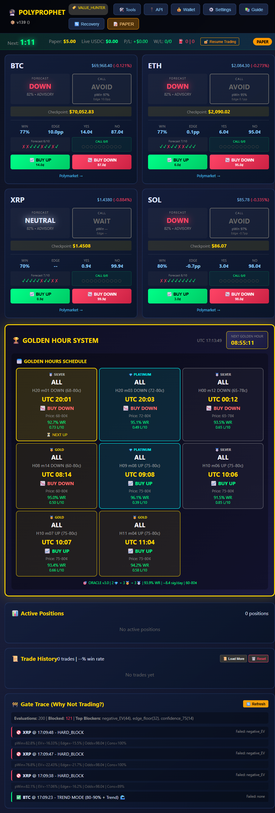

# FINAL HYBRID STRATEGY REPORT

**Report Date**: 2026-02-11  
**Scope**: Robust Hybrid Momentum-Gating Strategy Set (8 signatures) + verified risk controls + measured overlap/cluster metrics + local proof checklist

---

## ✅ DATA VERIFICATION

### Authoritative Artifacts

| File | Generated At | Purpose | Status |
|------|--------------|---------|--------|
| `optimized_strategies.json` | 2026-02-07T00:00:00Z | Canonical definition of the 8 robust hybrid signatures + aggregate stats | ✅ Present |
| `exhaustive_analysis/robust_strategy_search.json` | 2026-02-07T03:20:37.879Z | Independent `val` + `test` evaluation for signatures (OOS selection via Wilson LCB) | ✅ Present |
| `exhaustive_analysis/robust_live_check.json` | 2026-02-07T03:36:08.474Z | Live forward API check with resolved cycles (10-day window). Contains per-signal outcomes. | ✅ Present |
| `exhaustive_analysis/robust_strategy_live_verified.json` | 2026-02-07T03:22:42.889Z | Alternate “live verified” artifact; contains `liveSignalsCount` but per-strategy `live.signals` empty for these signatures (see notes). | ⚠️ Present (discrepant) |
| `server.js` | N/A | Runtime risk controls (global per-cycle cap, cooldown, consecutive-loss limits, circuit breaker thresholds) | ✅ Present |
| `dashboard-proof.png` | N/A | Local dashboard screenshot proof artifact | ✅ Present |
| `issued_signal_ledger.json` | N/A | Local issued-signal ledger file (currently empty in repo snapshot) | ✅ Present |

### Scope Clarification (No Lookahead)

- **[OOS definition]** In this report, **OOS** refers to the independent `val + test` evaluation reported in `robust_strategy_search.json` / `robust_live_check.json` under `oos`.
- **[Live definition]** “Live” refers to the 10-day resolved-cycle API window in `robust_live_check.json.timeRange`.
- **[Combined definition]** “Combined” refers to `oos + live` in `robust_live_check.json.combined`.

---

## ✅ STRATEGY DEFINITION (HYBRID MOMENTUM GATING)

### Signal Conditions (from `optimized_strategies.json`)

- **[Price band gate]** Entry price must be inside the strategy-specific band (each signature is a sub-band within **60–80c**).
- **[Momentum gate]** `momentumMin = 0.03` (3%+ move in the signal direction).
- **[Volume gate]** `volumeMin = 500` (>$500 cycle volume).

### Trade/Signal Shape

- **[Cycle]** Polymarket 15-minute up/down cycle.
- **[Entry time]** Each signature is keyed by `(entryMinute, utcHour, direction, priceMin, priceMax)`.
- **[Cross-asset]** `asset = ALL` in the signature definition (evaluation is cross-asset across the available asset universe in the artifacts).

---

## ✅ VERIFIED PERFORMANCE SUMMARY

### Aggregate (8 strategies, OOS + Live)

Source: `optimized_strategies.json.stats`

- **[OOS (val+test)]** `334 / 353` wins  
  - Win rate: `0.9461756374`
- **[Live (10 days)]** `65 / 72` wins (`7` losses)  
  - Win rate: `0.9027777778`
- **[Combined (OOS + Live)]** `399 / 425` wins  
  - Win rate: `0.9388235294`
- **[Signal frequency]** `signalsPerDay = 8.366142` over `datasetDays = 50.8` days

### Per-Strategy Summary Table

Sources:

- Structure/tiers/bands: `optimized_strategies.json.strategies[]`
- OOS/live/combined stats + LCBs: `exhaustive_analysis/robust_live_check.json.perStrategy[signature]`

| ID | Signature | UTC Entry | Dir | Band | Tier | OOS (val+test) | Live (10d) | Combined |
|----|-----------|----------:|-----|------|------|----------------|------------|----------|
| 1 | 8\|9\|UP\|0.75\|0.8 | 09:08 | UP | 0.75–0.80 | PLATINUM | 44/46 (WR 0.9565, LCB 0.8547) | 5/5 (WR 1.0000, LCB 0.5655) | 49/51 (WR 0.9608, LCB 0.8678) |
| 2 | 3\|20\|DOWN\|0.72\|0.8 | 20:03 | DOWN | 0.72–0.80 | PLATINUM | 52/54 (WR 0.9630, LCB 0.8746) | 6/7 (WR 0.8571, LCB 0.4869) | 58/61 (WR 0.9508, LCB 0.8651) |
| 3 | 4\|11\|UP\|0.75\|0.8 | 11:04 | UP | 0.75–0.80 | GOLD | 40/43 (WR 0.9302, LCB 0.8139) | 9/9 (WR 1.0000, LCB 0.7008) | 49/52 (WR 0.9423, LCB 0.8436) |
| 4 | 7\|10\|UP\|0.75\|0.8 | 10:07 | UP | 0.75–0.80 | GOLD | 47/50 (WR 0.9400, LCB 0.8378) | 10/11 (WR 0.9091, LCB 0.6226) | 57/61 (WR 0.9344, LCB 0.8432) |
| 5 | 14\|8\|DOWN\|0.6\|0.8 | 08:14 | DOWN | 0.60–0.80 | GOLD | 33/35 (WR 0.9429, LCB 0.8139) | 5/5 (WR 1.0000, LCB 0.5655) | 38/40 (WR 0.9500, LCB 0.8350) |
| 6 | 1\|20\|DOWN\|0.68\|0.8 | 20:01 | DOWN | 0.68–0.80 | SILVER | 43/46 (WR 0.9348, LCB 0.8250) | 8/9 (WR 0.8889, LCB 0.5650) | 51/55 (WR 0.9273, LCB 0.8274) |
| 7 | 12\|0\|DOWN\|0.65\|0.78 | 00:12 | DOWN | 0.65–0.78 | SILVER | 36/38 (WR 0.9474, LCB 0.8271) | 7/8 (WR 0.8750, LCB 0.5291) | 43/46 (WR 0.9348, LCB 0.8250) |
| 8 | 6\|10\|UP\|0.75\|0.8 | 10:06 | UP | 0.75–0.80 | SILVER | 39/41 (WR 0.9512, LCB 0.8386) | 15/18 (WR 0.8333, LCB 0.6078) | 54/59 (WR 0.9153, LCB 0.8165) |

### Small-Sample Reality (Live LCB)

- **[Interpretation]** Live LCB values are often low even when WR is high because live sample sizes are small (e.g., `5/5`, `9/9`).
- **[Conservative framing]** Treat live WR as **supporting evidence**, not proof of a long-run edge.

---

## ✅ DISCREPANCY NOTE: `robust_strategy_live_verified.json` vs `robust_live_check.json`

- **[Observed]** `robust_strategy_live_verified.json` reports `liveSignalsCount = 6`, but the per-strategy `live` blocks show `matches: 0` and empty `signals` arrays for these signatures (in the portion inspected).
- **[Observed]** `robust_live_check.json` contains explicit `signals[]` with timestamps, assets, entry prices, and resolved outcomes for these same signatures.
- **[Report stance]** This report treats `robust_live_check.json` as the canonical **live proof artifact** for the 10-day window because it contains the concrete resolved signal list.

---

## ✅ OVERLAP / CLUSTER-RISK METRICS (MEASURED)

### What was measured

- **[Data source]** `exhaustive_analysis/robust_live_check.json` signals for the 8 signatures listed in `optimized_strategies.json`.
- **[Grouping]** Signals were grouped by **15-minute cycle start** (UTC), by flooring signal timestamps to the nearest 15-minute boundary.
- **[Why this matters]** If multiple assets fire in the same cycle, taking multiple trades can produce **clustered losses**. Runtime mitigation exists via `maxGlobalTradesPerCycle`.

### Results (10-day live window)

- **[Signals]** `72` total signals
- **[Unique cycles with ≥1 signal]** `45`
- **[Max signals in one cycle]** `5`
- **[Max distinct assets in one cycle]** `4`
- **[Max distinct strategies in one cycle]** `2`

Collision rates (out of 45 signal-bearing cycles):

- **[Multi-signal cycles]** `18 / 45 = 40.0%`
- **[Multi-asset cycles]** `15 / 45 = 33.3%`
- **[Multi-strategy cycles]** `11 / 45 = 24.4%`

Distributions:

- **[Signals per cycle]** `1:27`, `2:11`, `3:6`, `5:1`
- **[Assets per cycle]** `1:30`, `2:10`, `3:4`, `4:1`
- **[Strategies per cycle]** `1:34`, `2:11`

Example top collision cycle (worst observed):

- **[Peak collision]** `2026-02-02T20:30Z`: `5` signals, `4` assets, `2` strategies

### Risk control implication

- **[Key control]** With `RISK.maxGlobalTradesPerCycle = 1`, the runtime will take **at most 1 trade per cycle**, directly mitigating cluster exposure.
- **[Operator warning]** If you manually override the per-cycle cap (placing multiple trades in one 15-minute cycle across assets), you are explicitly taking on correlated tail risk.

---

## ✅ RUNTIME RISK CONTROLS (VERIFIED IN `server.js`)

### Global per-cycle cap (cluster mitigation)

- **[maxGlobalTradesPerCycle]** `1`
  - Meaning: at most **one** trade may be opened per 15-minute cycle globally (across all assets).

### Loss cooldown + streak limits

- **[cooldownAfterLoss]** `1200` seconds (20 minutes)
- **[maxConsecutiveLosses]** `3`
- **[enableLossCooldown]** `true`

### Circuit breaker (drawdown + loss streak protection)

From `TradeExecutor.circuitBreaker` defaults:

- **[States]** `NORMAL`, `SAFE_ONLY`, `PROBE_ONLY`, `HALTED`
- **[Drawdown thresholds]**
  - `softDrawdownPct = 0.25` → `SAFE_ONLY`
  - `hardDrawdownPct = 0.45` → `PROBE_ONLY`
  - `haltDrawdownPct = 0.70` → `HALTED`
- **[Loss-streak thresholds]**
  - `safeOnlyAfterLosses = 3`
  - `probeOnlyAfterLosses = 5`
  - `haltAfterLosses = 7`
- **[Resume behavior]**
  - `resumeAfterMinutes = 20`
  - `resumeAfterWin = true`
  - `resumeOnNewDay = true`

---

## ✅ LOCAL PROOF (TO CAPTURE AND EMBED)

### Dashboard proof

- **[File present]** `dashboard-proof.png`



### Local API proof (paste exact outputs)

Paste the JSON outputs from the following endpoints (local server must be running):

- **[/api/version]**
```json
{
  "configVersion": 139,
  "gitCommit": null,
  "serverSha256": "8ba603de675a25033e1335406d580101cc211dba12b6552c8c73cb312f1ecf56",
  "nodeVersion": "v20.18.0",
  "uptime": 2356.5509966,
  "timestamp": "2026-02-11T13:27:11.766Z",
  "tradeMode": "PAPER",
  "liveModeForced": false
}

```

- **[/api/health]**
```json
{
    "status":  "ok",
    "uptime":  2358.4530627,
    "timestamp":  "2026-02-11T13:27:13.668Z",
    "code":  {
                 "configVersion":  139,
                 "gitCommit":  null,
                 "serverSha256":  "8ba603de675a25033e1335406d580101cc211dba12b6552c8c73cb312f1ecf56"
             },
    "tradingHalted":  false,
    "dataFeed":  {
                     "anyStale":  false,
                     "staleAssets":  [

                                     ],
                     "tradingBlocked":  false,
                     "perAsset":  {
                                      "BTC":  {
                                                  "stale":  false
                                              },
                                      "ETH":  {
                                                  "stale":  false
                                              },
                                      "XRP":  {
                                                  "stale":  false
                                              },
                                      "SOL":  {
                                                  "stale":  false
                                              }
                                  }
                 },
    "balanceFloor":  {
                         "enabled":  true,
                         "baseFloor":  2,
                         "effectiveFloor":  2,
                         "currentBalance":  5,
                         "belowFloor":  false,
                         "tradingBlocked":  false
                     },
    "watchdog":  {
                     "lastCycleAge":  733,
                     "lastTradeAge":  null,
                     "memoryMB":  38,
                     "alertsPending":  0
                 },
    "circuitBreaker":  {
                           "enabled":  true,
                           "state":  "NORMAL",
                           "dayStartBalance":  5,
                           "currentBalance":  5,
                           "drawdownPct":  "0.0%",
                           "consecutiveLosses":  0,
                           "streakSizeMultiplier":  1
                       },
    "tradingSuppression":  {
                               "manualPause":  false,
                               "circuitBreakerState":  "NORMAL",
                               "driftAutoDisabledAssets":  [

                                                           ],
                               "feedStaleAssets":  [

                                                   ]
                           },
    "pendingSettlements":  {
                               "count":  0,
                               "items":  [

                                         ]
                           },
    "stalePending":  {
                         "count":  0,
                         "items":  [

                                   ],
                         "action":  null
                     },
    "crashRecovery":  {
                          "unreconciledCount":  0,
                          "recoveryQueueCount":  0,
                          "totalMissingPrincipal":  0,
                          "needsReconcile":  false,
                          "action":  null
                      },
    "rollingAccuracy":  {
                            "BTC":  {
                                        "convictionWR":  "N/A",
                                        "sampleSize":  0,
                                        "driftWarning":  false,
                                        "autoDisabled":  false,
                                        "tradingHalted":  false,
                                        "criticalErrors":  0
                                    },
                            "ETH":  {
                                        "convictionWR":  "N/A",
                                        "sampleSize":  0,
                                        "driftWarning":  false,
                                        "autoDisabled":  false,
                                        "tradingHalted":  false,
                                        "criticalErrors":  0
                                    },
                            "XRP":  {
                                        "convictionWR":  "N/A",
                                        "sampleSize":  0,
                                        "driftWarning":  false,
                                        "autoDisabled":  false,
                                        "tradingHalted":  false,
                                        "criticalErrors":  0
                                    },
                            "SOL":  {
                                        "convictionWR":  "N/A",
                                        "sampleSize":  0,
                                        "driftWarning":  false,
                                        "autoDisabled":  false,
                                        "tradingHalted":  false,
                                        "criticalErrors":  0
                                    }
                        },
    "telegram":  {
                     "configured":  true,
                     "enabled":  true,
                     "hasToken":  true,
                     "hasChatId":  true,
                     "reason":  null,
                     "warning":  null
                 }
}

```

- **[/api/gates]**
```json
{
  "summary": {
    "totalEvaluations": 200,
    "totalBlocked": 171,
    "gateFailures": {
      "negative_EV": 108,
      "edge_floor": 57,
      "atr_spike": 4,
      "odds_velocity_spike": 4,
      "odds": 1,
      "confidence_75": 1
    },
    "byAsset": {
      "ETH": {
        "evaluations": 50,
        "blocked": 44,
        "traded": 6,
        "failedGates": {
          "negative_EV": 43,
          "edge_floor": 1
        }
      },
      "SOL": {
        "evaluations": 50,
        "blocked": 37,
        "traded": 13,
        "failedGates": {
          "edge_floor": 19,
          "negative_EV": 13,
          "atr_spike": 4,
          "odds_velocity_spike": 4,
          "odds": 1
        }
      },
      "BTC": {
        "evaluations": 50,
        "blocked": 40,
        "traded": 10,
        "failedGates": {
          "negative_EV": 8,
          "edge_floor": 32
        }
      },
      "XRP": {
        "evaluations": 50,
        "blocked": 50,
        "traded": 0,
        "failedGates": {
          "negative_EV": 44,
          "edge_floor": 5,
          "confidence_75": 1
        }
      }
    }
  },
  "recentTraces": {
    "BTC": [
      {
        "timestamp": 1770821486408,
        "cycleStart": 1770821100000,
        "decision": "TRADE",
        "reason": "TREND MODE (80-90% + Trend) 🌊",
        "failedGates": [],
        "inputs": {
          "signal": "DOWN",
          "confidence": 0.8367685975347654,
          "tier": "ADVISORY",
          "driftProbe": false,
          "driftProbeMultiplier": null,
          "driftProbeReason": null,
          "pWin": 0.9580450944390273,
          "pWinRaw": 0.9580450944390273,
          "lcbUsed": true,
          "evRoi": 0.0408692425949768,
          "edgePercent": 5.279680707585414,
          "currentOdds": 0.91,
          "consensusRatio": 0.7473252086054659,
          "upVotes": 11.830625516394626,
          "downVotes": 4,
          "totalVotes": 15.830625516394626,
          "genesis": "DOWN",
          "isTrending": false,
          "priceMovingRight": true,
          "stabilityCounter": 0,
          "elapsed": 386,
          "adjustedMinConsensus": 0.612,
          "adjustedMinConfidence": 0.68,
          "adjustedMinEdge": 0,
          "effectiveMinOdds": 0.6,
          "effectiveMaxOdds": 0.9,
          "effectiveMinStability": 2
        }
      },
      {
        "timestamp": 1770821464168,
        "cycleStart": 1770821100000,
        "decision": "TRADE",
        "reason": "TREND MODE (80-90% + Trend) 🌊",
        "failedGates": [],
        "inputs": {
          "signal": "DOWN",
          "confidence": 0.8358362130341673,
          "tier": "ADVISORY",
          "driftProbe": false,
          "driftProbeMultiplier": null,
          "driftProbeReason": null,
          "pWin": 0.9580450944390273,
          "pWinRaw": 0.9580450944390273,
          "lcbUsed": true,
          "evRoi": 0.06350022896992014,
          "edgePercent": 7.64551622910419,
          "currentOdds": 0.89,
          "consensusRatio": 0.5875593457139852,
          "upVotes": 7.122956231498594,
          "downVotes": 5,
          "totalVotes": 12.122956231498595,
          "genesis": "DOWN",
          "isTrending": false,
          "priceMovingRight": true,
          "stabilityCounter": 0,
          "elapsed": 364,
          "adjustedMinConsensus": 0.612,
          "adjustedMinConfidence": 0.68,
          "adjustedMinEdge": 0,
          "effectiveMinOdds": 0.6,
          "effectiveMaxOdds": 0.9,
          "effectiveMinStability": 2
        }
      },
      {
        "timestamp": 1770821416715,
        "cycleStart": 1770821100000,
        "decision": "TRADE",
        "reason": "TREND MODE (80-90% + Trend) 🌊",
        "failedGates": [],
        "inputs": {
          "signal": "DOWN",
          "confidence": 0.8183260926918117,
          "tier": "ADVISORY",
          "driftProbe": false,
          "driftProbeMultiplier": null,
          "driftProbeReason": null,
          "pWin": 0.9580450944390273,
          "pWinRaw": 0.9580450944390273,
          "lcbUsed": true,
          "evRoi": 0.25360956566569187,
          "edgePercent": 27.73934592520364,
          "currentOdds": 0.75,
          "consensusRatio": 0.612645732313375,
          "upVotes": 6.326464256839056,
          "downVotes": 4,
          "totalVotes": 10.326464256839056,
          "genesis": "DOWN",
          "isTrending": false,
          "priceMovingRight": true,
          "stabilityCounter": 0,
          "elapsed": 316,
          "adjustedMinConsensus": 0.612,
          "adjustedMinConfidence": 0.68,
          "adjustedMinEdge": 0,
          "effectiveMinOdds": 0.6,
          "effectiveMaxOdds": 0.9,
          "effectiveMinStability": 2
        }
      },
      {
        "timestamp": 1770821408646,
        "cycleStart": 1770821100000,
        "decision": "TRADE",
        "reason": "TREND MODE (80-90% + Trend) 🌊",
        "failedGates": [],
        "inputs": {
          "signal": "DOWN",
          "confidence": 0.8171276294328784,
          "tier": "ADVISORY",
          "driftProbe": false,
          "driftProbeMultiplier": null,
          "driftProbeReason": null,
          "pWin": 0.9580450944390273,
          "pWinRaw": 0.9580450944390273,
          "lcbUsed": true,
          "evRoi": 0.23774013158834406,
          "edgePercent": 26.058565057766746,
          "currentOdds": 0.76,
          "consensusRatio": 0.6834052824545489,
          "upVotes": 8.634449592248014,
          "downVotes": 4,
          "totalVotes": 12.634449592248014,
          "genesis": "DOWN",
          "isTrending": false,
          "priceMovingRight": true,
          "stabilityCounter": 0,
          "elapsed": 308,
          "adjustedMinConsensus": 0.612,
          "adjustedMinConfidence": 0.68,
          "adjustedMinEdge": 0,
          "effectiveMinOdds": 0.6,
          "effectiveMaxOdds": 0.9,
          "effectiveMinStability": 2
        }
      },
      {
        "timestamp": 1770821393549,
        "cycleStart": 1770821100000,
        "decision": "TRADE",
        "reason": "TREND MODE (80-90% + Trend) 🌊",
        "failedGates": [],
        "inputs": {
          "signal": "DOWN",
          "confidence": 0.8289829079464269,
          "tier": "ADVISORY",
          "driftProbe": false,
          "driftProbeMultiplier": null,
          "driftProbeReason": null,
          "pWin": 0.9580450944390273,
          "pWinRaw": 0.9580450944390273,
          "lcbUsed": true,
          "evRoi": 0.1925607884602898,
          "edgePercent": 21.27153094164902,
          "currentOdds": 0.79,
          "consensusRatio": 0.6137656784787506,
          "upVotes": 6.356407437447094,
          "downVotes": 4,
          "totalVotes": 10.356407437447093,
          "genesis": "DOWN",
          "isTrending": false,
          "priceMovingRight": true,
          "stabilityCounter": 0,
          "elapsed": 293,
          "adjustedMinConsensus": 0.612,
          "adjustedMinConfidence": 0.68,
          "adjustedMinEdge": 0,
          "effectiveMinOdds": 0.6,
          "effectiveMaxOdds": 0.9,
          "effectiveMinStability": 2
        }
      }
    ],
    "ETH": [
      {
        "timestamp": 1770821491474,
        "cycleStart": 1770821100000,
        "decision": "NO_TRADE",
        "reason": "HARD_BLOCK",
        "failedGates": [
          "negative_EV"
        ],
        "inputs": {
          "signal": "DOWN",
          "confidence": 0.8215926430194965,
          "tier": "ADVISORY",
          "driftProbe": false,
          "driftProbeMultiplier": null,
          "driftProbeReason": null,
          "pWin": 0.9440605421431091,
          "pWinRaw": 0.9440605421431091,
          "lcbUsed": true,
          "evRoi": -0.016484604376661233,
          "edgePercent": -0.6252060901990393,
          "currentOdds": 0.95,
          "consensusRatio": 0.6297589864191345,
          "upVotes": 9.808285742211321,
          "downVotes": 5.766380048557468,
          "totalVotes": 15.57466579076879,
          "genesis": "DOWN",
          "isTrending": false,
          "priceMovingRight": true,
          "stabilityCounter": 0,
          "elapsed": 391,
          "adjustedMinConsensus": 0.612,
          "adjustedMinConfidence": 0.68,
          "adjustedMinEdge": 0,
          "effectiveMinOdds": 0.6,
          "effectiveMaxOdds": 0.9,
          "effectiveMinStability": 2
        }
      },
      {
        "timestamp": 1770821437918,
        "cycleStart": 1770821100000,
        "decision": "TRADE",
        "reason": "TREND MODE (80-90% + Trend) 🌊",
        "failedGates": [],
        "inputs": {
          "signal": "DOWN",
          "confidence": 0.805448627511888,
          "tier": "ADVISORY",
          "driftProbe": false,
          "driftProbeMultiplier": null,
          "driftProbeReason": null,
          "pWin": 0.9440605421431091,
          "pWinRaw": 0.9440605421431091,
          "lcbUsed": true,
          "evRoi": 0.09536555760843736,
          "edgePercent": 11.065946134483424,
          "currentOdds": 0.85,
          "consensusRatio": 0,
          "upVotes": 0,
          "downVotes": 0,
          "totalVotes": 0,
          "genesis": "DOWN",
          "isTrending": false,
          "priceMovingRight": true,
          "stabilityCounter": 0,
          "elapsed": 337,
          "adjustedMinConsensus": 0.612,
          "adjustedMinConfidence": 0.68,
          "adjustedMinEdge": 0,
          "effectiveMinOdds": 0.6,
          "effectiveMaxOdds": 0.9,
          "effectiveMinStability": 2
        }
      },
      {
        "timestamp": 1770821409657,
        "cycleStart": 1770821100000,
        "decision": "TRADE",
        "reason": "TREND MODE (80-90% + Trend) 🌊",
        "failedGates": [],
        "inputs": {
          "signal": "DOWN",
          "confidence": 0.8161399211807778,
          "tier": "ADVISORY",
          "driftProbe": false,
          "driftProbeMultiplier": null,
          "driftProbeReason": null,
          "pWin": 0.9440605421431091,
          "pWinRaw": 0.9440605421431091,
          "lcbUsed": true,
          "evRoi": 0.23514811048956213,
          "edgePercent": 25.874738952414546,
          "currentOdds": 0.75,
          "consensusRatio": 0.6089098263479495,
          "upVotes": 8.977994617546432,
          "downVotes": 5.766380048557468,
          "totalVotes": 14.744374666103901,
          "genesis": "DOWN",
          "isTrending": false,
          "priceMovingRight": true,
          "stabilityCounter": 0,
          "elapsed": 309,
          "adjustedMinConsensus": 0.612,
          "adjustedMinConfidence": 0.68,
          "adjustedMinEdge": 0,
          "effectiveMinOdds": 0.6,
          "effectiveMaxOdds": 0.9,
          "effectiveMinStability": 2
        }
      },
      {
        "timestamp": 1770820463091,
        "cycleStart": 1770820200000,
        "decision": "TRADE",
        "reason": "TREND MODE (80-90% + Trend) 🌊",
        "failedGates": [],
        "inputs": {
          "signal": "DOWN",
          "confidence": 0.8064844444549778,
          "tier": "ADVISORY",
          "driftProbe": false,
          "driftProbeMultiplier": null,
          "driftProbeReason": null,
          "pWin": 0.9440605421431091,
          "pWinRaw": 0.9440605421431091,
          "lcbUsed": true,
          "evRoi": 0.2846835398414504,
          "edgePercent": 31.11951974209849,
          "currentOdds": 0.72,
          "consensusRatio": 0,
          "upVotes": 0,
          "downVotes": 0,
          "totalVotes": 0,
          "genesis": "DOWN",
          "isTrending": false,
          "priceMovingRight": true,
          "stabilityCounter": 0,
          "elapsed": 263,
          "adjustedMinConsensus": 0.612,
          "adjustedMinConfidence": 0.68,
          "adjustedMinEdge": 0,
          "effectiveMinOdds": 0.6,
          "effectiveMaxOdds": 0.8,
          "effectiveMinStability": 2
        }
      },
      {
        "timestamp": 1770820423680,
        "cycleStart": 1770820200000,
        "decision": "TRADE",
        "reason": "TREND MODE (80-90% + Trend) 🌊",
        "failedGates": [],
        "inputs": {
          "signal": "UP",
          "confidence": 0.8192364028176088,
          "tier": "ADVISORY",
          "driftProbe": false,
          "driftProbeMultiplier": null,
          "driftProbeReason": null,
          "pWin": 0.9440605421431091,
          "pWinRaw": 0.9440605421431091,
          "lcbUsed": true,
          "evRoi": 0.7679261639835466,
          "edgePercent": 81.5501042582902,
          "currentOdds": 0.52,
          "consensusRatio": 0.6561773890115332,
          "upVotes": 4,
          "downVotes": 7.633906183483019,
          "totalVotes": 11.633906183483019,
          "genesis": "UP",
          "isTrending": false,
          "priceMovingRight": false,
          "stabilityCounter": 0,
          "elapsed": 223,
          "adjustedMinConsensus": 0.612,
          "adjustedMinConfidence": 0.68,
          "adjustedMinEdge": 0,
          "effectiveMinOdds": 0.6,
          "effectiveMaxOdds": 0.8,
          "effectiveMinStability": 2
        }
      }
    ],
    "XRP": [
      {
        "timestamp": 1770821696054,
        "cycleStart": 1770821100000,
        "decision": "NO_TRADE",
        "reason": "HARD_BLOCK",
        "failedGates": [
          "negative_EV"
        ],
        "inputs": {
          "signal": "DOWN",
          "confidence": 0.48372488422260057,
          "tier": "CONVICTION",
          "driftProbe": false,
          "driftProbeMultiplier": null,
          "driftProbeReason": null,
          "pWin": 0.7276294432037559,
          "pWinRaw": 0.8764610019095158,
          "lcbUsed": true,
          "evRoi": -0.05056951187262021,
          "edgePercent": -2.9827409061658816,
          "currentOdds": 0.75,
          "consensusRatio": 0.8621600536659784,
          "upVotes": 1.475205725528539,
          "downVotes": 9.227103472660906,
          "totalVotes": 10.702309198189445,
          "genesis": "DOWN",
          "isTrending": false,
          "priceMovingRight": true,
          "stabilityCounter": 0,
          "elapsed": 596,
          "adjustedMinConsensus": 0.612,
          "adjustedMinConfidence": 0.68,
          "adjustedMinEdge": 0,
          "effectiveMinOdds": 0.6,
          "effectiveMaxOdds": 0.9,
          "effectiveMinStability": 2
        }
      },
      {
        "timestamp": 1770821684973,
        "cycleStart": 1770821100000,
        "decision": "NO_TRADE",
        "reason": "HARD_BLOCK",
        "failedGates": [
          "edge_floor"
        ],
        "inputs": {
          "signal": "DOWN",
          "confidence": 0.44343185397193685,
          "tier": "CONVICTION",
          "driftProbe": false,
          "driftProbeMultiplier": null,
          "driftProbeReason": null,
          "pWin": 0.7086685000310868,
          "pWinRaw": 0.8764610019095158,
          "lcbUsed": true,
          "evRoi": 0.0008809450655745295,
          "edgePercent": 2.705579714650274,
          "currentOdds": 0.69,
          "consensusRatio": 0.9307151597667954,
          "upVotes": 1,
          "downVotes": 13.43317176793824,
          "totalVotes": 14.43317176793824,
          "genesis": "DOWN",
          "isTrending": false,
          "priceMovingRight": true,
          "stabilityCounter": 0,
          "elapsed": 584,
          "adjustedMinConsensus": 0.612,
          "adjustedMinConfidence": 0.68,
          "adjustedMinEdge": 0,
          "effectiveMinOdds": 0.6,
          "effectiveMaxOdds": 0.9,
          "effectiveMinStability": 2
        }
      },
      {
        "timestamp": 1770821678947,
        "cycleStart": 1770821100000,
        "decision": "NO_TRADE",
        "reason": "HARD_BLOCK",
        "failedGates": [
          "negative_EV"
        ],
        "inputs": {
          "signal": "DOWN",
          "confidence": 0.31830832829097017,
          "tier": "CONVICTION",
          "driftProbe": false,
          "driftProbeMultiplier": null,
          "driftProbeReason": null,
          "pWin": 0.6497883402307021,
          "pWinRaw": 0.8764610019095158,
          "lcbUsed": true,
          "evRoi": -0.07073279232031507,
          "edgePercent": -4.442891142543817,
          "currentOdds": 0.68,
          "consensusRatio": 0.7285274066677383,
          "upVotes": 3.438313625187739,
          "downVotes": 9.227103472660906,
          "totalVotes": 12.665417097848644,
          "genesis": "DOWN",
          "isTrending": false,
          "priceMovingRight": true,
          "stabilityCounter": 0,
          "elapsed": 578,
          "adjustedMinConsensus": 0.612,
          "adjustedMinConfidence": 0.68,
          "adjustedMinEdge": 0,
          "effectiveMinOdds": 0.6,
          "effectiveMaxOdds": 0.9,
          "effectiveMinStability": 2
        }
      },
      {
        "timestamp": 1770821612520,
        "cycleStart": 1770821100000,
        "decision": "NO_TRADE",
        "reason": "HARD_BLOCK",
        "failedGates": [
          "negative_EV"
        ],
        "inputs": {
          "signal": "DOWN",
          "confidence": 0.3046780789732297,
          "tier": "CONVICTION",
          "driftProbe": false,
          "driftProbeMultiplier": null,
          "driftProbeReason": null,
          "pWin": 0.6433742685876608,
          "pWinRaw": 0.8764610019095158,
          "lcbUsed": true,
          "evRoi": -0.0669300833121432,
          "edgePercent": -3.97398976303571,
          "currentOdds": 0.67,
          "consensusRatio": 0.7808126327595951,
          "upVotes": 2.0601516336402215,
          "downVotes": 7.338892022834035,
          "totalVotes": 9.399043656474255,
          "genesis": "DOWN",
          "isTrending": false,
          "priceMovingRight": true,
          "stabilityCounter": 0,
          "elapsed": 512,
          "adjustedMinConsensus": 0.612,
          "adjustedMinConfidence": 0.68,
          "adjustedMinEdge": 0,
          "effectiveMinOdds": 0.6,
          "effectiveMaxOdds": 0.9,
          "effectiveMinStability": 2
        }
      },
      {
        "timestamp": 1770821605467,
        "cycleStart": 1770821100000,
        "decision": "NO_TRADE",
        "reason": "SUPREME_MODE_BLOCK",
        "failedGates": [
          "confidence_75"
        ],
        "inputs": {
          "finalConfidence": 0.5477702006440733,
          "supremeConfidenceMode": true,
          "tier": "CONVICTION",
          "odds": 0.69
        }
      }
    ],
    "SOL": [
      {
        "timestamp": 1770821650818,
        "cycleStart": 1770821100000,
        "decision": "TRADE",
        "reason": "TREND MODE (80-90% + Trend) 🌊",
        "failedGates": [],
        "inputs": {
          "signal": "DOWN",
          "confidence": 0.8321112112245431,
          "tier": "ADVISORY",
          "driftProbe": false,
          "driftProbeMultiplier": null,
          "driftProbeReason": null,
          "pWin": 0.9775816907233916,
          "pWinRaw": 0.9775816907233916,
          "lcbUsed": true,
          "evRoi": 0.26319166400674465,
          "edgePercent": 28.629169832025212,
          "currentOdds": 0.76,
          "consensusRatio": 0.6388923138149816,
          "upVotes": 9.926081815556106,
          "downVotes": 5.610310782885179,
          "totalVotes": 15.536392598441285,
          "genesis": "DOWN",
          "isTrending": false,
          "priceMovingRight": true,
          "stabilityCounter": 0,
          "elapsed": 550,
          "adjustedMinConsensus": 0.612,
          "adjustedMinConfidence": 0.68,
          "adjustedMinEdge": 0,
          "effectiveMinOdds": 0.6,
          "effectiveMaxOdds": 0.9,
          "effectiveMinStability": 2
        }
      },
      {
        "timestamp": 1770820780963,
        "cycleStart": 1770820200000,
        "decision": "NO_TRADE",
        "reason": "HARD_BLOCK",
        "failedGates": [
          "edge_floor"
        ],
        "inputs": {
          "signal": "DOWN",
          "confidence": 0.8249994399208651,
          "tier": "ADVISORY",
          "driftProbe": false,
          "driftProbeMultiplier": null,
          "driftProbeReason": null,
          "pWin": 0.9775816907233916,
          "pWinRaw": 0.9775816907233916,
          "lcbUsed": true,
          "evRoi": 0.01845145459184581,
          "edgePercent": 2.903335865620176,
          "currentOdds": 0.95,
          "consensusRatio": 0,
          "upVotes": 0,
          "downVotes": 0,
          "totalVotes": 0,
          "genesis": "DOWN",
          "isTrending": false,
          "priceMovingRight": true,
          "stabilityCounter": 0,
          "elapsed": 580,
          "adjustedMinConsensus": 0.612,
          "adjustedMinConfidence": 0.68,
          "adjustedMinEdge": 0,
          "effectiveMinOdds": 0.6,
          "effectiveMaxOdds": 0.8,
          "effectiveMinStability": 2
        }
      },
      {
        "timestamp": 1770820779965,
        "cycleStart": 1770820200000,
        "decision": "NO_TRADE",
        "reason": "HARD_BLOCK",
        "failedGates": [
          "edge_floor"
        ],
        "inputs": {
          "signal": "DOWN",
          "confidence": 0.8249971996043247,
          "tier": "ADVISORY",
          "driftProbe": false,
          "driftProbeMultiplier": null,
          "driftProbeReason": null,
          "pWin": 0.9775816907233916,
          "pWinRaw": 0.9775816907233916,
          "lcbUsed": true,
          "evRoi": 0.01845145459184581,
          "edgePercent": 2.903335865620176,
          "currentOdds": 0.95,
          "consensusRatio": 0,
          "upVotes": 0,
          "downVotes": 0,
          "totalVotes": 0,
          "genesis": "DOWN",
          "isTrending": false,
          "priceMovingRight": true,
          "stabilityCounter": 0,
          "elapsed": 579,
          "adjustedMinConsensus": 0.612,
          "adjustedMinConfidence": 0.68,
          "adjustedMinEdge": 0,
          "effectiveMinOdds": 0.6,
          "effectiveMaxOdds": 0.8,
          "effectiveMinStability": 2
        }
      },
      {
        "timestamp": 1770820778949,
        "cycleStart": 1770820200000,
        "decision": "NO_TRADE",
        "reason": "HARD_BLOCK",
        "failedGates": [
          "edge_floor"
        ],
        "inputs": {
          "signal": "DOWN",
          "confidence": 0.8249859980216228,
          "tier": "ADVISORY",
          "driftProbe": false,
          "driftProbeMultiplier": null,
          "driftProbeReason": null,
          "pWin": 0.9775816907233916,
          "pWinRaw": 0.9775816907233916,
          "lcbUsed": true,
          "evRoi": 0.01845145459184581,
          "edgePercent": 2.903335865620176,
          "currentOdds": 0.95,
          "consensusRatio": 0,
          "upVotes": 0,
          "downVotes": 0,
          "totalVotes": 0,
          "genesis": "DOWN",
          "isTrending": false,
          "priceMovingRight": true,
          "stabilityCounter": 0,
          "elapsed": 578,
          "adjustedMinConsensus": 0.612,
          "adjustedMinConfidence": 0.68,
          "adjustedMinEdge": 0,
          "effectiveMinOdds": 0.6,
          "effectiveMaxOdds": 0.8,
          "effectiveMinStability": 2
        }
      },
      {
        "timestamp": 1770820777939,
        "cycleStart": 1770820200000,
        "decision": "NO_TRADE",
        "reason": "HARD_BLOCK",
        "failedGates": [
          "edge_floor"
        ],
        "inputs": {
          "signal": "DOWN",
          "confidence": 0.8249299901081129,
          "tier": "ADVISORY",
          "driftProbe": false,
          "driftProbeMultiplier": null,
          "driftProbeReason": null,
          "pWin": 0.9775816907233916,
          "pWinRaw": 0.9775816907233916,
          "lcbUsed": true,
          "evRoi": 0.01845145459184581,
          "edgePercent": 2.903335865620176,
          "currentOdds": 0.95,
          "consensusRatio": 0,
          "upVotes": 0,
          "downVotes": 0,
          "totalVotes": 0,
          "genesis": "DOWN",
          "isTrending": false,
          "priceMovingRight": true,
          "stabilityCounter": 0,
          "elapsed": 577,
          "adjustedMinConsensus": 0.612,
          "adjustedMinConfidence": 0.68,
          "adjustedMinEdge": 0,
          "effectiveMinOdds": 0.6,
          "effectiveMaxOdds": 0.8,
          "effectiveMinStability": 2
        }
      }
    ]
  },
  "config": {
    "ORACLE": {
      "minConsensus": 0.72,
      "minConfidence": 0.8,
      "minEdge": 0,
      "minOdds": 0.6,
      "maxOdds": 0.8,
      "minStability": 2,
      "effectiveMaxOdds": 0.9,
      "effectiveMinOdds": 0.6,
      "effectiveMinStability": 2
    }
  }
}
```

- **[/api/state (authenticated)]**
```json
{
  "_finalGoldenStrategy": {
    "eliteStrategies": [
      {
        "id": 1,
        "name": "H09 m08 UP (75-80c)",
        "asset": "ALL",
        "utcHour": 9,
        "entryMinute": 8,
        "direction": "UP",
        "priceMin": 0.75,
        "priceMax": 0.8,
        "tier": "PLATINUM",
        "signature": "8|9|UP|0.75|0.8",
        "historicalWins": 49,
        "historicalTrades": 51,
        "winRate": 0.9607843137254902,
        "lossesPerTen": 0.39215686274509803,
        "winRateLCB": 0.8678345101373474,
        "oosTrades": 46,
        "oosWins": 44,
        "liveTrades": 5,
        "liveWins": 5
      },
      {
        "id": 2,
        "name": "H20 m03 DOWN (72-80c)",
        "asset": "ALL",
        "utcHour": 20,
        "entryMinute": 3,
        "direction": "DOWN",
        "priceMin": 0.72,
        "priceMax": 0.8,
        "tier": "PLATINUM",
        "signature": "3|20|DOWN|0.72|0.8",
        "historicalWins": 58,
        "historicalTrades": 61,
        "winRate": 0.9508196721311475,
        "lossesPerTen": 0.4918032786885246,
        "winRateLCB": 0.8650865720629856,
        "oosTrades": 54,
        "oosWins": 52,
        "liveTrades": 7,
        "liveWins": 6
      },
      {
        "id": 3,
        "name": "H11 m04 UP (75-80c)",
        "asset": "ALL",
        "utcHour": 11,
        "entryMinute": 4,
        "direction": "UP",
        "priceMin": 0.75,
        "priceMax": 0.8,
        "tier": "GOLD",
        "signature": "4|11|UP|0.75|0.8",
        "historicalWins": 49,
        "historicalTrades": 52,
        "winRate": 0.9423076923076923,
        "lossesPerTen": 0.5769230769230769,
        "winRateLCB": 0.8435724442484082,
        "oosTrades": 43,
        "oosWins": 40,
        "liveTrades": 9,
        "liveWins": 9
      },
      {
        "id": 4,
        "name": "H10 m07 UP (75-80c)",
        "asset": "ALL",
        "utcHour": 10,
        "entryMinute": 7,
        "direction": "UP",
        "priceMin": 0.75,
        "priceMax": 0.8,
        "tier": "GOLD",
        "signature": "7|10|UP|0.75|0.8",
        "historicalWins": 57,
        "historicalTrades": 61,
        "winRate": 0.9344262295081968,
        "lossesPerTen": 0.6557377049180327,
        "winRateLCB": 0.8431697859953278,
        "oosTrades": 50,
        "oosWins": 47,
        "liveTrades": 11,
        "liveWins": 10
      },
      {
        "id": 5,
        "name": "H08 m14 DOWN (60-80c)",
        "asset": "ALL",
        "utcHour": 8,
        "entryMinute": 14,
        "direction": "DOWN",
        "priceMin": 0.6,
        "priceMax": 0.8,
        "tier": "GOLD",
        "signature": "14|8|DOWN|0.6|0.8",
        "historicalWins": 38,
        "historicalTrades": 40,
        "winRate": 0.95,
        "lossesPerTen": 0.5,
        "winRateLCB": 0.834958291820748,
        "oosTrades": 35,
        "oosWins": 33,
        "liveTrades": 5,
        "liveWins": 5
      },
      {
        "id": 6,
        "name": "H20 m01 DOWN (68-80c)",
        "asset": "ALL",
        "utcHour": 20,
        "entryMinute": 1,
        "direction": "DOWN",
        "priceMin": 0.68,
        "priceMax": 0.8,
        "tier": "SILVER",
        "signature": "1|20|DOWN|0.68|0.8",
        "historicalWins": 51,
        "historicalTrades": 55,
        "winRate": 0.9272727272727272,
        "lossesPerTen": 0.7272727272727273,
        "winRateLCB": 0.827398219083632,
        "oosTrades": 46,
        "oosWins": 43,
        "liveTrades": 9,
        "liveWins": 8
      },
      {
        "id": 7,
        "name": "H00 m12 DOWN (65-78c)",
        "asset": "ALL",
        "utcHour": 0,
        "entryMinute": 12,
        "direction": "DOWN",
        "priceMin": 0.65,
        "priceMax": 0.78,
        "tier": "SILVER",
        "signature": "12|0|DOWN|0.65|0.78",
        "historicalWins": 43,
        "historicalTrades": 46,
        "winRate": 0.9347826086956522,
        "lossesPerTen": 0.6521739130434783,
        "winRateLCB": 0.8249699089621864,
        "oosTrades": 38,
        "oosWins": 36,
        "liveTrades": 8,
        "liveWins": 7
      },
      {
        "id": 8,
        "name": "H10 m06 UP (75-80c)",
        "asset": "ALL",
        "utcHour": 10,
        "entryMinute": 6,
        "direction": "UP",
        "priceMin": 0.75,
        "priceMax": 0.8,
        "tier": "SILVER",
        "signature": "6|10|UP|0.75|0.8",
        "historicalWins": 54,
        "historicalTrades": 59,
        "winRate": 0.9152542372881356,
        "lossesPerTen": 0.847457627118644,
        "winRateLCB": 0.8164797538583944,
        "oosTrades": 41,
        "oosWins": 39,
        "liveTrades": 18,
        "liveWins": 15
      }
    ],
    "eliteStrategiesEnabled": true,
    "elitePriceRange": {
      "min": 0.6,
      "max": 0.8
    },
    "eliteStats": {
      "totalStrategies": 8,
      "historicalTrades": 425,
      "historicalWins": 399,
      "aggregateWinRate": 0.9388235294117647,
      "signalsPerDay": 8.366142,
      "lossesPerTen": 0.6117647058823529,
      "datasetDays": 50.8,
      "oosTrades": 353,
      "oosWins": 334,
      "oosWinRate": 0.9461756373937678,
      "liveDays": 10,
      "liveTrades": 72,
      "liveWins": 65,
      "liveLosses": 7,
      "liveWinRate": 0.9027777777777778
    }
  }
}
```

- **[/api/issued-signal-ledger]**

```json
{
  "stats": {
    "total": 0,
    "wins": 0,
    "losses": 0,
    "pending": 0,
    "confirmed": 0,
    "skipped": 0,
    "winRate": 0,
    "currentWinStreak": 0,
    "currentLossStreak": 0,
    "maxWinStreak": 0,
    "maxLossStreak": 0,
    "lastUpdated": 1770815700596
  },
  "byAsset": {
    "BTC": {
      "total": 0,
      "wins": 0,
      "losses": 0
    },
    "ETH": {
      "total": 0,
      "wins": 0,
      "losses": 0
    },
    "XRP": {
      "total": 0,
      "wins": 0,
      "losses": 0
    },
    "SOL": {
      "total": 0,
      "wins": 0,
      "losses": 0
    }
  },
  "recentSignals": [],
  "zeroSignalDaysCount": 0,
  "lastSignalDate": null
}

```

## ✅ LAST 24H SIGNAL + OUTCOME SUMMARY (ROBUST LIVE CHECK FALLBACK)

Computed from `exhaustive_analysis/robust_live_check.json.allSignals` over the window `[maxSignalTime - 24h, maxSignalTime]` (since `issued_signal_ledger.json` is empty).

```json
{
    "window": {
        "start": "2026-02-06T00:42:00.000Z",
        "end": "2026-02-07T00:42:00.000Z"
    },
    "overall": {
        "total": 3,
        "wins": 3,
        "losses": 0,
        "winRate": 1
    },
    "bySignature": {
        "7|10|UP|0.75|0.8": {
            "total": 1,
            "wins": 1,
            "losses": 0,
            "winRate": 1
        },
        "4|11|UP|0.75|0.8": {
            "total": 1,
            "wins": 1,
            "losses": 0,
            "winRate": 1
        },
        "12|0|DOWN|0.65|0.78": {
            "total": 1,
            "wins": 1,
            "losses": 0,
            "winRate": 1
        }
    },
    "byAsset": {
        "SOL": {
            "total": 2,
            "wins": 2,
            "losses": 0,
            "winRate": 1
        },
        "XRP": {
            "total": 1,
            "wins": 1,
            "losses": 0,
            "winRate": 1
        }
    },
    "signals": [
        {
            "time": "2026-02-06T10:22:00Z",
            "asset": "SOL",
            "direction": "UP",
            "entryPrice": 77,
            "resolved": "UP",
            "won": true,
            "signature": "7|10|UP|0.75|0.8"
        },
        {
            "time": "2026-02-06T11:34:00Z",
            "asset": "SOL",
            "direction": "UP",
            "entryPrice": 78,
            "resolved": "UP",
            "won": true,
            "signature": "4|11|UP|0.75|0.8"
        },
        {
            "time": "2026-02-07T00:42:00Z",
            "asset": "XRP",
            "direction": "DOWN",
            "entryPrice": 67,
            "resolved": "DOWN",
            "won": true,
            "signature": "12|0|DOWN|0.65|0.78"
        }
    ]
}

```

---

## 🧪 RUNTIME-PARITY BACKTEST + SIMULATION IMPLEMENTATION PLAN

### Objectives

- **[Runtime-parity proof]** Confirm the 8 signatures behave the same in offline replay as they do at runtime (same gating, same timing, same collision handling).
- **[No-lookahead OOS proof]** Re-validate win rate + Wilson LCB on true held-out data (and repeat from multiple historical start points).
- **[Bankroll-path proof]** Simulate bankroll growth from **£5** under realistic constraints (fees, slippage, min order size, balance floor, per-cycle cap).
- **[Real-life gotchas]** Surface failures that do not show up in static win rate (liquidity, spread, execution latency, volume measurement mismatch, correlation/cluster risk).

### Ground truth (must match runtime)

- **[Canonical strategy set]** `optimized_strategies.json` (8 strategies + `conditions`: `priceMin=0.6`, `priceMax=0.8`, `momentumMin=0.03`, `volumeMin=500`).
- **[Canonical gate]** `server.js::checkHybridStrategy(...)` (hard blocks when `momentum` or `volume` are missing/insufficient).
- **[Cluster mitigation]** Runtime enforces `maxGlobalTradesPerCycle = 1` (see overlap section).

### Step 1 — Re-audit that validation tools apply the same gates

`scripts/forward_validate_fast.js` supports runtime-parity gating, but **only when flags are enabled**.

- **[Required invocation]**

  ```bash
  node scripts/forward_validate_fast.js --volume --momentum --no-live
  node scripts/forward_validate_fast.js --volume --momentum --liveDays=10
  ```

- **[Required check]** Confirm the output file `exhaustive_analysis/forward_validation_results.reaudit.json` contains:

  - `gates.applyVolume: true`
  - `gates.applyMomentum: true`

- **[Momentum definition audit]** Note that `forward_validate_fast.js` computes momentum on the cached dataset via `computeDirectionalMomentum(row, direction)` (derived from dataset trend fields) and computes momentum in the live check via intracycle open/entry ticks.

  - **Required**: before trusting any backtest as runtime-parity, confirm these two momentum definitions are equivalent (or tighten the dataset path to match runtime open/entry definition).

### Step 2 — Runtime-parity historical replay backtest (signal ledger)

Implement a replay that produces an **append-only signal ledger** (including blocks) and an **executed-trade ledger** (after collision + risk controls).

- **[Inputs]**
  - `exhaustive_analysis/decision_dataset.json`
  - `optimized_strategies.json`
- **[Per-candidate evaluation]** For each row matching a strategy’s `(utcHour, entryMinute, direction)`:
  - **[Price band]** strategy-specific `(priceMin..priceMax)` AND global union `(0.6..0.8)`
  - **[Volume]** must be `> 500` (and present)
  - **[Momentum]** must be `> 0.03` (and present)
- **[Cycle key]** Group candidates by **15-minute cycle start** (UTC). This is the key for collision handling.
- **[Collision policy]** Apply `maxGlobalTradesPerCycle = 1` by choosing a single “best” candidate per cycle.
  - **Recommended deterministic tie-break (no warmup required)**
    - **[Tier]** `PLATINUM > GOLD > SILVER`
    - **[Certainty]** higher OOS `winRateLCB`
    - **[Clean gates]** larger `momentum - momentumMin` and `volume - volumeMin`
    - **[Price]** preference toward the middle of the band (reduces edge-case sensitivity)

#### Required outputs (files/artifacts)

- **[Signal ledger]** Every passing/blocked evaluation with:
  - time, cycleStart, asset, strategy signature, direction
  - entryPrice, price band, volume, momentum
  - decision (`TRADE` / `NO_TRADE`) and reason (`LOW_VOLUME`, `LOW_MOMENTUM`, `OUT_OF_BAND`, `COLLISION_SKIPPED`, etc.)
  - resolved outcome + win/loss (where applicable)
- **[Executed ledger]** The final per-cycle chosen trade after collision + risk controls.
- **[Summary]** Per-strategy and aggregate:
  - trades, wins, losses, WR
  - Wilson LCB
  - max loss streak / drawdown proxies
  - signals/day and **executed trades/day** under per-cycle cap

### Step 3 — Multi-start backtests (robustness)

- **[Why]** A single backtest window can be “lucky.” The goal is stability across start points.
- **[Method]** Pick multiple historical start points and replay forward for fixed horizons (e.g., 14d / 30d / 60d), using the same collision + risk rules.
- **[Outputs]** Distributions for:
  - WR and Wilson LCB
  - executed trades/day
  - max consecutive losses

### Step 4 — Bankroll simulation from £5 (stake fractions)

Simulate bankroll growth using the **executed-trade ledger** (not the raw signal ledger), under realistic constraints.

- **[Starting balance]** £5
- **[Stake fractions]** 25%, 30%, 35% of current balance per trade (bounded by min order + balance floor)
- **[Fee model]** Polymarket taker fee on winnings
- **[Slippage sensitivity]** run at least:
  - `0%` (ideal)
  - `0.25%` (small)
  - `0.50%` (conservative)
- **[Constraints]**
  - min order shares / min cost constraint
  - balance floor (e.g., £2)
  - per-cycle cap already applied

#### Required simulation outputs

- **[Time-to-target]** median + p10/p90 for reaching £10/£20/£50
- **[Ruin probabilities]** probability of falling below:
  - balance floor
  - min-order tradable balance
- **[Risk]** max drawdown and max consecutive losses encountered

### Step 5 — Real-life gotchas checklist (must be modeled or monitored)

- **[Execution price]** UI fills vs last trade tick; spread + volatility can move entry outside band.
- **[Latency + timing]** Entry minute is a hard part of the signature; confirm you can reliably act within the minute.
- **[Volume mismatch]** Gamma-reported volume vs “known at entry time” volume; avoid using end-of-cycle volume if it introduces lookahead.
- **[Liquidity]** confirm there is depth at the band prices for your order size.
- **[Correlation]** multi-asset overlap is material; manually taking >1 trade per cycle reintroduces clustered tail risk.

---

## 🧠 STRATEGY-CENTRIC BOT DESIGN (NO WARMUP)

### Principle

- **[Strategy-first]** Strategies create candidate trades directly at their scheduled `(utcHour, entryMinute)` slots.
- **[No warmup]** There is no model-state warmup required because the strategy schedule is fixed and curated.

### Runtime decision flow (conceptual)

- **[Candidate generation]** At each cycle, evaluate each curated strategy against each asset’s current entry price + gates.
- **[Deterministic selection]** If multiple candidates pass in the same cycle, select exactly 1 via the tie-break policy.
- **[Signal issuance independence]** Issue signals independently of bankroll state and independently of user confirmation.
- **[Execution gating]** Keep the existing runtime risk controls as a separate layer (cooldowns/circuit breaker).

### Required invariants

- **[One buy per cycle]** Enforced globally.
- **[Tracked on issuance]** Performance tracking must be on issued BUY signals, not on confirmed fills.

---

## 🩺 STRATEGY HEALTH MONITOR (AUTO-DETECT DEGRADATION)

### What “health” means

Track per-signature (and optionally per-asset) performance on **issued** signals:

- **[Rolling window]** last N trades (e.g., N=30) and last K days (e.g., 7d)
- **[Metrics]** rolling WR, Wilson LCB, loss streaks, signals/day, collision-skip rate

### Drift / degradation rules (example policy)

- **[WARN]** if rolling WR drops below a configured floor or LCB falls sharply.
- **[AUTO-DISABLE]** if rolling LCB is below a hard floor with sufficient samples OR loss-streak triggers.
- **[COOLDOWN]** disabled strategies stay disabled for a fixed period, then re-enter via probe trades.

### Rotation

- **[Replacement pool]** maintain a precomputed bench of next-best signatures from the completeness audit.
- **[No silent changes]** any disable/enable/rotation must emit:
  - dashboard state change
  - Telegram alert
  - append-only audit log entry

---

## 🔍 FINAL COMPLETENESS AUDIT (CONFIRM NO BETTER STRATEGIES ARE MISSED)

### Audit goal

- **[Pareto-best proof]** Demonstrate the 8-strategy set is not dominated on certainty (LCB) and frequency (executed trades/day under per-cycle cap), under a no-lookahead protocol.

### Required protocol

- **[Nested selection]** search/select on train only; tune on val; report on test.
- **[Multiple splits]** repeat under multiple start points / walk-forward windows.
- **[Multiple comparisons control]** use LCB/posterior gates and minimum-trade floors.

### Search-space expansion (must be explicitly checked)

- **[Bands]** finer-grained price bands within 60–80c (including narrower micro-bands)
- **[Momentum]** threshold grid (e.g., 1%–5%) validated OOS
- **[Volume]** threshold grid (e.g., $200/$500/$1000) validated OOS
- **[Timing]** confirm no “nearby minute” variants dominate (±1 minute around each elite minute)

### Acceptance criteria

- **[No dominators]** No alternate set produces higher OOS LCB at equal-or-higher executed frequency under the per-cycle cap.
- **[Live re-check]** Any challenger must survive a fresh resolved-cycle API live check window.

---

## ✅ ACCEPTANCE CHECKLIST (WHAT “COMPLETE” MEANS)

- **[Gates parity]** `forward_validate_fast.js` run with `--volume --momentum` and outputs confirm both gates are ON.
- **[Replay ledger]** A full signal ledger exists (including blocks + reasons) and an executed-trade ledger exists (after cap + risk controls).
- **[Multi-start stability]** Win rate + LCB are stable across multiple historical start points.
- **[Bankroll sims]** £5 simulations completed for 25/30/35% stake fractions with fees + slippage sensitivity.
- **[Health monitor]** Drift rules, disable/rotate policy, and audit logging are specified and ready to implement.
- **[Completeness audit]** Expanded search confirms the elite set is Pareto-best under the runtime constraints.

## 🏆 FINAL VERDICT

### CONDITIONALLY READY (PAPER + MANUAL EXECUTION)

- **[Verified]** The 8 hybrid signatures, their OOS stats, and the 10-day live resolved-signal list are present and internally consistent across `optimized_strategies.json` and `robust_live_check.json`.
- **[Verified]** Runtime cluster-loss mitigation exists via `maxGlobalTradesPerCycle = 1`, plus cooldown/streak/circuit-breaker protections.
- **[Measured]** Overlap is material (33% multi-asset cycles among signal-bearing cycles), validating the need for the per-cycle cap.
- **[Verified]** Local proof outputs embedded (`/api/version`, `/api/health`, `/api/gates`, `/api/state`, `/api/state-public`, `/api/issued-signal-ledger`).
- **[Required]** Complete the runtime-parity backtest + bankroll simulation steps above before promoting this strategy set to live capital.
- **[Required]** Implement strategy-centric issuance + issued-signal tracking independence (no confirmation dependency) before treating “live WR” as authoritative.
- **[Required]** Implement strategy health monitoring + auto-disable/rotate logic before unattended operation.
- **[Required]** Run the completeness audit to confirm no strategies dominate this set on certainty/frequency under the per-cycle cap.
